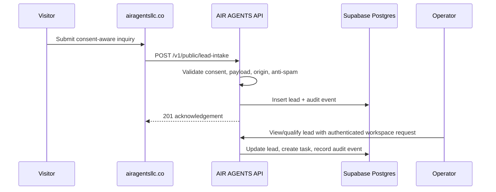
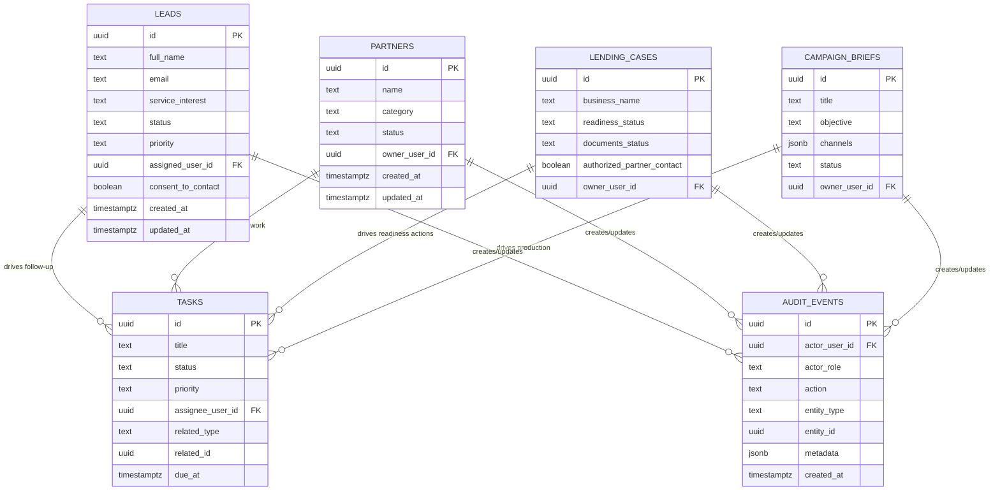
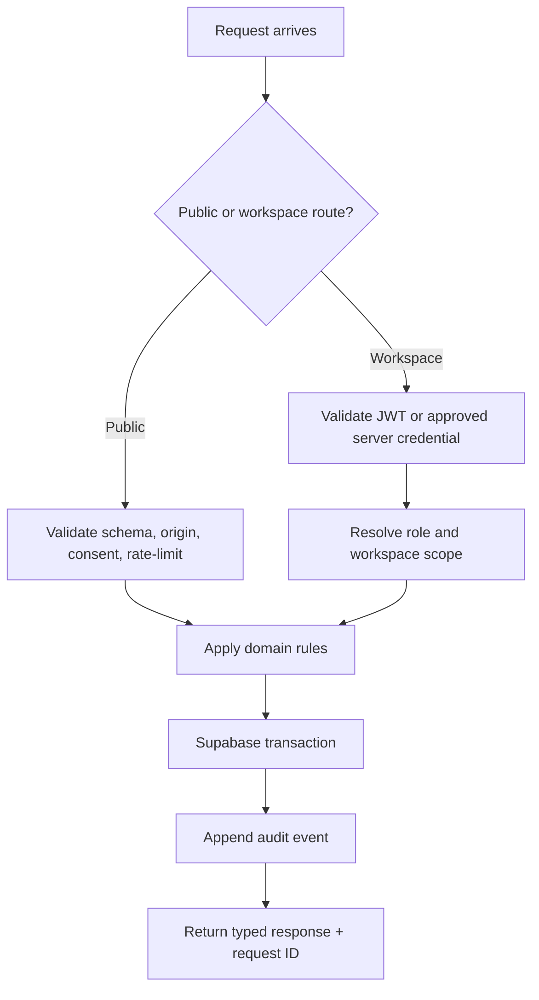

# AIR AGENTS LLC — Architecture & Operations

**System:** `airagentsllc.co`  
**Scope:** Public portfolio, operating API, Supabase data layer, workflows, security, and production operations  
**Status:** Target architecture; reflects the existing public site and the versioned FastAPI service now present in this repository.

> **Operating principle:** AIR AGENTS connects strategy, AI-enabled workflows, partner coordination, creative production, and lending-readiness operations. Every automated action is bounded by consent, role-based access, traceability, and human review.

---

## 1. Architecture at a glance

```mermaid
flowchart LR
    Visitor[Visitor / Client] --> Website[airagentsllc.co\nPublic portfolio]
    Operator[Authorized operator] --> Workspace[AIR / COMMAND workspace\nInternal app]

    Website -->|Public service discovery| API[api.airagentsllc.co\nFastAPI v1]
    Website -->|Consent-aware lead form| API
    Workspace -->|JWT / service-backed requests| API

    API --> Auth[Supabase Auth\nUser identity & roles]
    API --> DB[(Supabase Postgres\nOperational records)]
    API --> Storage[Supabase Storage\nApproved documents & media]
    API --> Audit[(Audit events\nImmutable operational history)]

    API <-->|Signed webhook events| Integrations[Approved integrations\nGitHub · Retell · Canva · email · partner tools]
    CI[GitHub repository & CI] -->|Build / test / deploy| API
    Observability[Logs · metrics · alerts] <-- API
```

## 2. Component model

| Layer | Responsibility | Primary technologies | Operational rule |
|---|---|---|---|
| **Experience** | Explain services, display portfolio, collect an inquiry | `airagentsllc.co` public site | Expose only public content and consent-aware form fields. |
| **API boundary** | Validate requests, enforce access policy, publish OpenAPI contract | FastAPI at `api.airagentsllc.co` | Version routes under `/v1`; reject unknown fields, unauthenticated workspace calls, and unapproved origins. |
| **Identity & authorization** | Authenticate internal users and map privileges to operations | Supabase Auth + JWT claims / API gateway policy | Least privilege: viewer, operator, administrator. Keep service credentials server-side. |
| **Operational data** | Persist leads, partners, tasks, readiness, briefs, and audit history | Supabase Postgres | Enforce Row Level Security (RLS), timestamps, structured statuses, and indexed query paths. |
| **Files & media** | Store approved partner documents, creative assets, and media references | Supabase Storage | Private buckets by default; signed URLs with short expiration; do not place sensitive uploads in public buckets. |
| **Integration edge** | Receive only verified events and send approved outbound actions | FastAPI webhook routes / provider SDKs | Verify signatures, deduplicate event IDs, log outcome, and queue/retry non-critical work. |
| **Delivery & operations** | Test, deploy, observe, and recover | GitHub, container host, Supabase, logging platform | Deploy immutable builds; use migrations; back up data; preserve auditability. |

---

## 3. Public website operations

### 3.1 Public-to-private handoff

The website is the **discovery and intake surface**, not the source of truth for protected operations.

1. A visitor browses AI growth systems, partner operations, voice-agent automation, media production, lending coordination, or creative launchpad services.
2. The form submits a minimal payload to `POST /v1/public/lead-intake`.
3. The API validates:
   - name, email, service interest, and message shape;
   - explicit consent to contact;
   - spam-trap field; and
   - allowed browser origin.
4. The API creates a `lead` record in Supabase and writes an audit event.
5. An authorized operator sees the lead in the workspace, assigns an owner, and creates the next task.



### 3.2 Public API surface

| Endpoint | Purpose | Live-access expectation |
|---|---|---|
| `GET /health` | Health probe for hosting, uptime checks, and DNS validation | Public |
| `GET /docs` | Interactive API reference | Public; consider IP or access restriction after production onboarding |
| `GET /openapi.json` | Machine-readable API contract | Public |
| `GET /v1/public/services` | Approved service catalog for the portfolio | Public |
| `POST /v1/public/lead-intake` | Consent-aware inquiry ingestion | Public after durable database, rate limit, and WAF are enabled |

---

## 4. Internal operating domains

The workspace is organized around accountable records—not unstructured chat history.

| Domain | System record | Primary operation | Human owner |
|---|---|---|---|
| **Lead Strategy** | `leads` | Capture, score, qualify, nurture, and close opportunities | Growth / account operator |
| **Partnered Operations** | `partners` | Onboard vendors and partners, track status and relationship notes | Operations owner |
| **Execution** | `tasks` | Assign next actions, due dates, blockers, and linked records | Assignee |
| **Lending Desk** | `lending_cases` | Track business context, document readiness, and authorized coordination | Lending coordinator |
| **Creative Launchpad** | `campaign_briefs` | Define objective, audience, message, channels, visual direction, and CTA | Creative / marketing owner |
| **Accountability** | `audit_events` | Record creation and state changes by role | Administrator / compliance owner |

> **Lending Desk boundary:** The system is an operational coordination tool. It must not generate a credit offer, make a lending or underwriting decision, give financial advice, or promise funding.

---

## 5. Supabase target data architecture

### 5.1 Core relational model



### 5.2 Supabase schema controls

| Control | Implementation |
|---|---|
| **Primary keys** | `uuid` generated by Postgres, never client-generated for protected records. |
| **Timestamps** | `created_at` and `updated_at` as `timestamptz`; trigger updates `updated_at`. |
| **Status integrity** | `CHECK` constraints or Postgres enums for lead, task, partner, lending, and creative states. |
| **Audit history** | Append-only `audit_events`; no client delete policy. |
| **Relationship ownership** | `owner_user_id` / `assignee_user_id` linked to `auth.users` where appropriate. |
| **Sensitive data** | Never store payment card data, government IDs, account credentials, underwriting decisions, or unneeded personal data. |
| **Retention** | Establish a documented retention schedule; purge or anonymize stale leads when business and legal requirements permit. |

### 5.3 Row Level Security model

Supabase RLS is the final database guardrail. The FastAPI service remains the primary business-policy layer.

| Role | Allowed actions | RLS pattern |
|---|---|---|
| **Public visitor** | Create a minimal lead only through the API | No direct table access; API uses a narrowly scoped server-side flow. |
| **Viewer** | Read assigned or permitted workspace data | `SELECT` policy based on JWT user identity / membership. |
| **Operator** | Create and update operational records in an approved workspace | `SELECT`, `INSERT`, `UPDATE` policies scoped by membership / role. |
| **Administrator** | Manage membership and inspect audit records | Explicit admin claim or membership-role policy. |
| **Service role** | Backend-only migration and controlled server operations | Never exposed in browser code, client bundles, or public docs. |

---

## 6. API operations

### 6.1 Request lifecycle



### 6.2 Security boundary

- **Public routes** must use strict input validation, WAF/rate limits, CORS, spam detection, and minimal responses.
- **Workspace routes** must authenticate users with Supabase JWTs or an internal server-to-server credential.
- **Service-role credentials** belong only in the FastAPI hosting environment—not the website, browser, source control, or client-side application.
- **API documentation** should never expose real keys, raw database strings, secrets, or provider webhook signatures.
- Every protected write should create an `audit_event` with actor identity, action, entity, timestamp, and safe metadata.

### 6.3 API identity migration

The initial API includes static role-based keys for early private operation. The Supabase integration should evolve this to:

1. Supabase Auth signs in a workspace operator.
2. The client receives a short-lived Supabase access token.
3. FastAPI verifies the JWT against the Supabase project’s JWT configuration.
4. FastAPI resolves membership/role and executes the approved database operation.
5. Supabase RLS independently limits record access.

Static API keys can remain for restricted machine-to-machine connections, but should be rotated, stored in a secret manager, and never used by browser clients.

---

## 7. Webhooks and external integrations

### 7.1 Webhook route pattern

A production webhook should use a dedicated route, for example:

```text
POST /v1/webhooks/{provider}
```

Examples: `/v1/webhooks/github`, `/v1/webhooks/retell`, or `/v1/webhooks/canva`.

| Step | Requirement |
|---|---|
| 1. Authenticate | Verify the provider’s HMAC/signature before parsing or acting on the event. |
| 2. Deduplicate | Store provider event ID and reject repeats idempotently. |
| 3. Normalize | Translate the provider event into an internal, typed event. |
| 4. Authorize | Confirm the event applies to an approved workspace, object, and workflow. |
| 5. Persist | Record the event and resulting state transition in Postgres. |
| 6. Execute | Invoke bounded follow-up work; require human review for consequential actions. |
| 7. Observe | Record success/failure, response code, and retry state without logging secrets. |

### 7.2 GitHub integration boundary

GitHub webhooks should be used for repository events such as `push`, `pull_request`, `workflow_run`, and `installation` events. They are not a substitute for repository permissions.

The GitHub App must request and receive both:

- **Contents: Read and write** — to update repository files.
- **Workflows: Read and write** — to create or update `.github/workflows/*` files.

When enabled, GitHub sends signed events to `POST https://api.airagentsllc.co/v1/webhooks/github`. The webhook secret must be stored only in the API host’s environment.

---

## 8. Deployment topology

| Environment | Purpose | Data behavior |
|---|---|---|
| **Local development** | Build and test FastAPI contract | Local SQLite may be used for isolated unit tests only. |
| **Preview** | Review `/health`, `/docs`, and OpenAPI contract | Intake disabled; no durable customer data; no workspace credentials. |
| **Staging** | Integration tests with an isolated Supabase project/schema | Synthetic test data only. |
| **Production** | Serve `api.airagentsllc.co` | Supabase Postgres, configured authentication, RLS, backups, monitoring, rate limiting, and approved DNS/TLS. |

### Production host responsibilities

- serve TLS for `api.airagentsllc.co`;
- supply environment variables and encrypted secrets;
- run the FastAPI container or managed service;
- expose `/health` for readiness/liveness checks;
- retain structured application logs; and
- provide rollback to a prior immutable build.

Supabase is the durable backend. Vercel’s anonymous contract preview is deliberately not a production data host because its filesystem is not a durable SQLite database.

---

## 9. Operating procedures

### 9.1 Lead operating procedure

1. Capture consent-aware inquiry.
2. Verify basic fit and context.
3. Set lead status and priority.
4. Assign a responsible operator.
5. Create next-action task with deadline.
6. Record relevant communication and state transitions.
7. Close, nurture, or delete/anonymize based on the retention policy.

### 9.2 Partner operating procedure

1. Create partner record and category.
2. Verify an approved point of contact.
3. Record working status, scope, and next action.
4. Create shared tasks rather than relying on email threads as the source of truth.
5. Review inactive/paused partnerships on a defined cadence.

### 9.3 Lending-readiness procedure

1. Capture business context and stated funding objective.
2. Track requested documents and readiness status.
3. Confirm authorization before partner communication.
4. Log coordination and follow-up actions.
5. Avoid collecting unnecessary sensitive data; do not capture or imply a credit decision.

### 9.4 Creative production procedure

1. Create campaign brief with objective, audience, message, channels, visual direction, and CTA.
2. Route the brief to review and approval.
3. Link production tasks and approved asset references.
4. Mark status changes from draft through production and completion.
5. Preserve the approved brief as the authoritative creative direction.

---

## 10. Observability and continuity

| Signal | Minimum implementation |
|---|---|
| **Availability** | External `GET /health` check and alerting. |
| **API reliability** | Request count, latency, 4xx/5xx rate, and dependency failures. |
| **Security** | Failed authentication count, unexpected origin rejections, webhook signature failures, and anomalous rate-limit events. |
| **Data integrity** | Migration status, database backup completion, RLS policy tests, and failed transaction alerts. |
| **Business workflow** | New leads, aging open tasks, unassigned leads, stalled readiness cases, and campaign status counts. |
| **Recovery** | Documented restore test, service rollback procedure, secret rotation process, and incident contact owner. |

## 11. Implementation sequence

1. **Authorize Supabase** and select the AIR AGENTS project.
2. Apply the initial Postgres migration: tables, indexes, audit triggers, and RLS.
3. Add Supabase environment variables to the FastAPI host—never to the public website.
4. Migrate FastAPI repository operations from SQLite to Supabase/PostgREST or direct Postgres access.
5. Replace browser-visible workspace keys with Supabase Auth JWTs.
6. Deploy the durable API at `api.airagentsllc.co`.
7. Add DNS/TLS, rate limiting, and WAF policy.
8. Connect the public form only after production health, write-path, and audit tests pass.
9. Add signed webhook handlers only for explicitly approved integrations.
10. Run backup, restore, role/RLS, and incident-response drills before expanded access.

---

## 12. Architecture decisions

| Decision | Rationale |
|---|---|
| Keep the portfolio separate from protected operations | Limits public attack surface and avoids exposing workspace credentials. |
| Use a versioned API | Makes browser, partner, and internal integration changes predictable. |
| Use Supabase Postgres for durable operational records | Replaces ephemeral/local SQLite with managed database, auth, storage, backup, and RLS capabilities. |
| Keep human accountability in each workflow | AI may draft, classify, or assist; people approve consequential outreach, partner steps, financial coordination, and publication. |
| Require explicit webhook verification | Prevents forged provider events from becoming operational actions. |
| Retain audit events | Supports operational review, access accountability, and troubleshooting. |

---

## Reference artifacts

- [API deployment guide](API_DEPLOYMENT.md)
- [FastAPI service entrypoint](../air_agents_api/main.py)
- [Current storage repository](../air_agents_api/repository.py)
- [OpenAPI preview](https://temporary-snappy-bamboo-cfuw5un.vercel.app/openapi.json) — temporary contract review only; not a production endpoint
